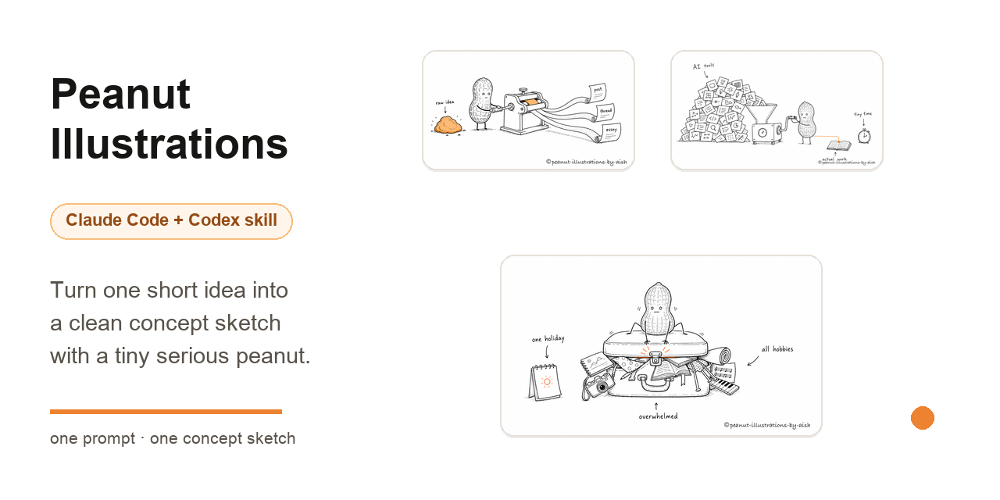
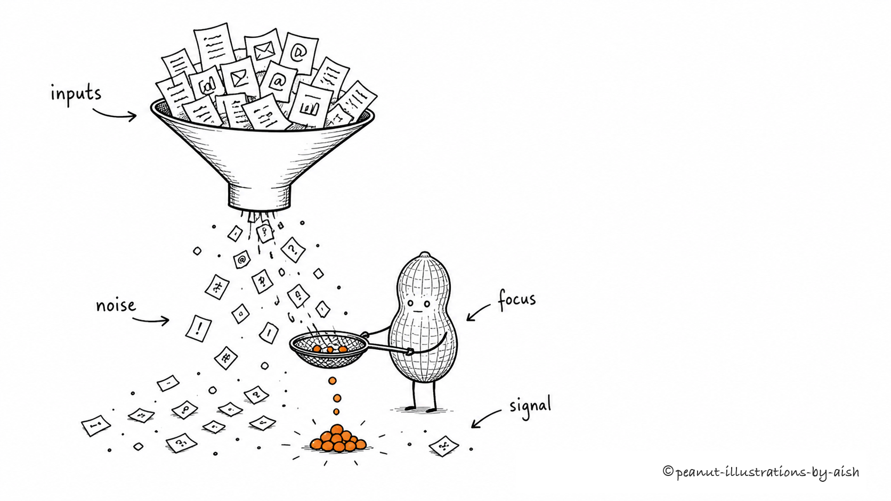
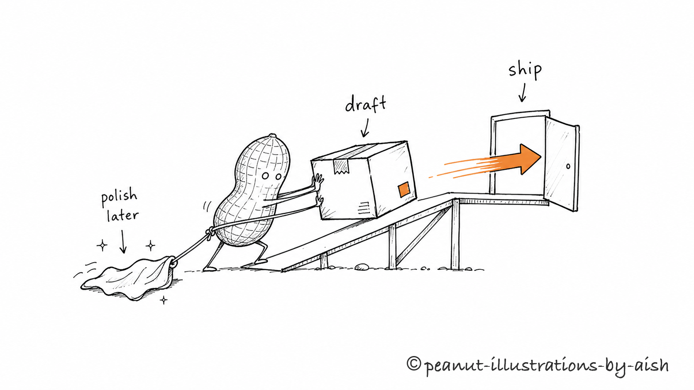
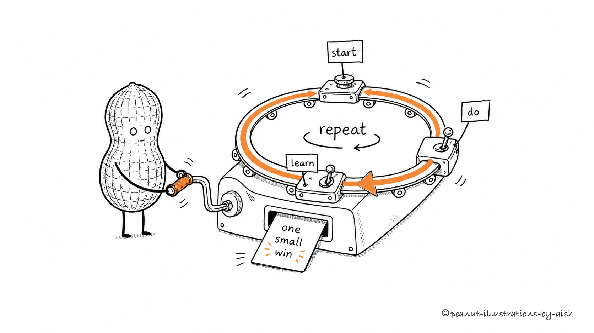
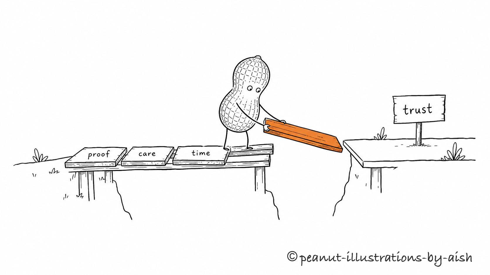

# Peanut Illustrations



> Turn one short idea into a clean concept sketch with a tiny serious peanut.

[](LICENSE)
[](#install)
[](#install)
[](https://github.com/aishwaryaashok14/peanut-illustrations/stargazers)

**Peanut Illustrations** is an AI-agent skill for making white-background concept sketches with a tiny recurring character. Give it one idea in a sentence. It invents the metaphor, puts the peanut to work inside it, and generates one memorable 16:9 image.

**Built by Aishwarya Ashok** - [X](https://x.com/aishashok14) · [LinkedIn](https://www.linkedin.com/in/aishwarya-ashok/)

```text
Use $peanut-illustrations to draw a concept illustration for:
"too many tools, not enough focus"
```

## Gallery

These are real outputs from the skill. Each starts as one short prompt, then becomes one composed scene with the peanut doing the core work.

### One idea, three formats

> *"Turn one raw idea into a post, a thread, and an essay."*


### Too many AI tools, too little time

> *"Too many AI tools and too little time to do the actual work."*


### One holiday, all the hobbies

> *"Trying to cram every hobby into one short holiday."*


### Information overload

> *"Information overload."*



### Shipping beats polishing

> *"Shipping beats polishing."*



### A small loop you can repeat

> *"A small loop you can repeat."*



### Building trust slowly

> *"Building trust slowly."*



More copy-pasteable prompts live in [examples/prompts.md](examples/prompts.md).

## Install

Clone the repo:

```bash
git clone https://github.com/aishwaryaashok14/peanut-illustrations.git
cd peanut-illustrations
```

### Claude Code

```bash
mkdir -p "$HOME/.claude/skills"
cp -R ./peanut-illustrations "$HOME/.claude/skills/"
```

Then invoke it:

```text
Use $peanut-illustrations to draw a concept illustration for:
"shipping beats polishing"
```

### OpenAI Codex

```bash
mkdir -p "${CODEX_HOME:-$HOME/.codex}/skills"
cp -R ./peanut-illustrations "${CODEX_HOME:-$HOME/.codex}/skills/"
```

Then invoke it:

```text
Use $peanut-illustrations to draw a concept illustration for:
"trust is built one piece of evidence at a time"
```

## What makes it different

- **One idea per image.** No dense infographics, dashboards, or PPT-style flowcharts.
- **The peanut must do the work.** It is not a mascot pasted in the corner.
- **Clean visual DNA.** Pure white background, black hand-drawn line, generous whitespace, and one warm-orange accent.
- **Compose first, draw second.** The skill states the metaphor, labels, peanut action, and layout before generating.
- **Watermark handled locally.** Final images use the exact `© peanut-illustrations-by-aish` watermark instead of asking the image model to spell it.

## How to use

### Draw one idea

```text
Use $peanut-illustrations to draw a concept illustration for this idea:

Trust isn't announced - it's laid down one piece of evidence at a time.

Keep it strange but clean, and the peanut must perform the core action.
```

### Draw several ideas at once

```text
Use $peanut-illustrations to draw one image each for these ideas:
- information overload
- shipping beats polishing
- a small loop you can repeat

One composed image per idea, not a collage.
```

### Edit an image

```text
Use $peanut-illustrations to edit this image:
remove the "Workflow" title in the top-left corner, keep everything else the same.
```

## What it produces

By default:

- one 16:9 horizontal concept illustration per prompt
- a short compose note before each image
- a final PNG saved to `assets/<prompt-slug>-illustrations/`

By default not:

- PPTX / PDF / Keynote
- SVG / HTML / Canvas editable graphics
- commercial posters or cover key visuals
- text-heavy infographics

## How it works

The skill's flow is:

1. Read the short prompt and identify the idea type: judgment, process, contrast, state, or metaphor.
2. Compose the scene: metaphor, peanut action, 2-3 labels, and layout.
3. Generate one image with the image model.
4. Check against the QA list: white background, whitespace, peanut action, single accent, readable labels, not-a-PPT.
5. Add the final watermark locally and save the PNG.

One prompt means one composed image. It only makes variations when you ask for them.

## Repo structure

```text
.
├── README.md
├── LICENSE
├── NOTICE.md
├── assets/
│   └── social-preview.png
├── examples/
│   ├── images/
│   └── prompts.md
└── peanut-illustrations/
    ├── SKILL.md
    ├── agents/
    │   └── openai.yaml
    ├── references/
    └── scripts/
```

The installable agent skill is the `peanut-illustrations/` subdirectory. The root README, examples, license, and notice are GitHub-facing docs.

## GitHub social preview

Use [assets/social-preview.png](assets/social-preview.png) as the repository social preview image:

```text
GitHub repo -> Settings -> Social preview -> Upload image
```

GitHub requires manual upload here; repo files alone do not set the preview card.

## Notes

- Shorter labels are more stable; keep on-image text to a few short words.
- One image = one core structure. Do not turn a prompt into a manual.
- If removing the peanut leaves the image intact, the peanut is too decorative.
- AI image models can produce typos, hallucinated labels, style drift, or extra titles. Check the result before sharing.
- If text is garbled, reduce the number of labels and regenerate.

## Inspiration and credits

This project is **adapted and translated from** [ian-xiaohei-illustrations](https://github.com/helloianneo/ian-xiaohei-illustrations) by Ian ([@ianneo_ai](https://x.com/ianneo_ai)), an MIT-licensed skill for hand-drawn Chinese article illustrations built around the "小黑 (Xiaohei)" character.

Portions are adapted and translated from the original. Peanut Illustrations changes the character (a deadpan peanut), reduces the palette to a single warm-orange accent, switches output to English, and uses a short-prompt single-image input model. No artwork from the original is redistributed; all images are independently generated. See [NOTICE.md](NOTICE.md) for the retained upstream copyright notice.

## License

MIT License. See [LICENSE](LICENSE).
