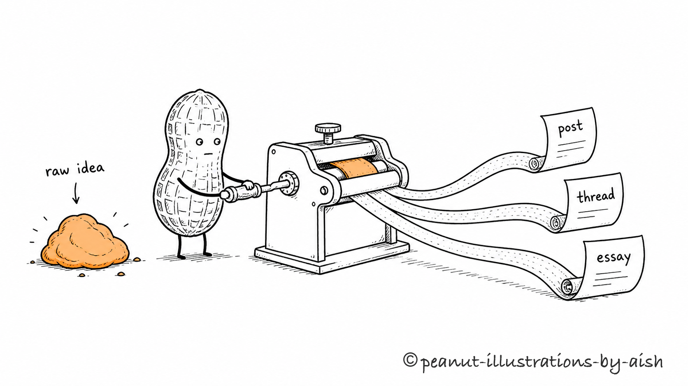
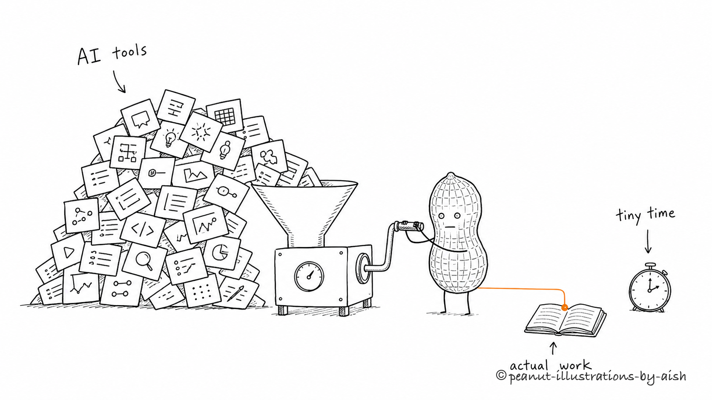
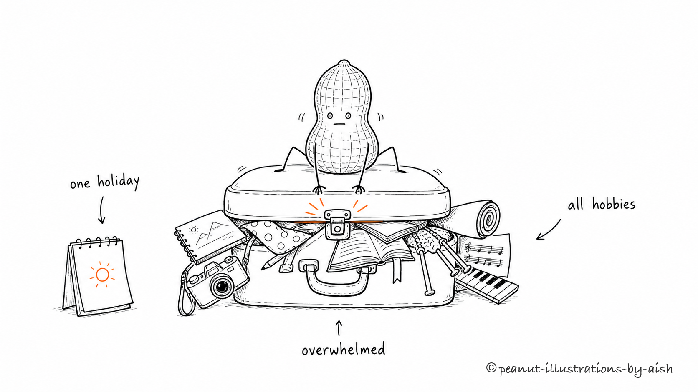

# Peanut Illustrations

> Turn a short prompt — a judgment, a process, a state, a metaphor — into one white-background, hand-drawn, deadpan-but-clean concept illustration.
>
> 16:9 · a deadpan peanut · black hand-drawn line · one warm-orange accent · Codex + Claude skill

**Built by Aishwarya Ashok** — [X](https://x.com/aishashok14) · [LinkedIn](https://www.linkedin.com/in/aishwarya-ashok/)

---

## What this is

Peanut Illustrations is an AI-agent skill that helps an agent turn a **short prompt** into a single concept illustration. You give it one idea in a sentence; it invents a fitting visual metaphor, puts a small deadpan peanut to work inside it, and draws it.

It is not a general illustration prompt, and it is not a PPT infographic template. The point is to take one judgment, process, structure, state, or metaphor and turn it into a memorable 16:9 hand-drawn explainer.

The recurring character is **the peanut**: a whole in-shell peanut with dot eyes, two thin legs, and a blank, serious face. The peanut is not a mascot or a sticker sitting in a corner — it is an absurd worker, calmly and gravely doing the job that explains the idea.

In one line: **don't just "add a picture" — draw the one key idea, with the peanut doing the work.**

---

## Who it's for

A good fit if you:

- write posts, blogs, Notion docs, or methodology content and want concept figures
- want to turn an abstract judgment into a concrete metaphor
- want a look that is lighter, stranger, and more recognizable than a PPT infographic
- use an AI agent for content and want a stable, reusable visual language

Not a fit if you want:

- commercial illustration, brand key visuals, or polished flat art
- traditional PPT infographics, complex architecture, or flowcharts
- children's cartoons, cute IP, or sticker-pack style
- a dense, text-heavy explainer crammed into one image
- strictly editable vector source files

---

## What it produces

By default:

- one 16:9 horizontal concept illustration per prompt
- a short "compose" note before each image: the metaphor, the peanut's action, the labels, and the composition
- a final PNG saved to `assets/<prompt-slug>-illustrations/`

By default not:

- PPTX / PDF / Keynote
- SVG / HTML / Canvas editable graphics
- commercial posters or cover key visuals
- text-heavy infographics

---

## Visual style

The skill uses a **single-accent duotone** style:

- pure white background — no paper texture, beige, shadow, or gradient
- black hand-drawn line art, thin lines, slight wobble
- lots of whitespace — the subject is only about 40%-60% of the canvas
- exactly **one** accent color (warm orange by default), used only for the single point of emphasis
- one image expresses one core action, structure, state, or metaphor
- the peanut must perform the core action, never just decorate
- deadpan, inventive, clean — not childish, not cutesy

---

## Examples

Each image starts from one short prompt and becomes a single composed scene — the peanut performs the action, one warm-orange accent carries the eye, and there's plenty of white space.

### One idea, three formats

> *"Turn one raw idea into a post, a thread, and an essay."*



### Too many AI tools, too little time

> *"Too many AI tools and too little time to do the actual work."*



### One holiday, all the hobbies

> *"Trying to cram every hobby into one short holiday."*



These are real outputs from the skill. Generate your own with the prompts in [examples/prompts.md](examples/prompts.md).

---

## Install

Clone the repo:

```bash
git clone https://github.com/aishwaryaashok14/peanut-illustrations.git
cd peanut-illustrations
```

### Claude Code

Copy the skill into your Claude skills directory:

```bash
mkdir -p "$HOME/.claude/skills"
cp -R ./peanut-illustrations "$HOME/.claude/skills/"
```

### OpenAI Codex

Copy the skill into your Codex skills directory:

```bash
mkdir -p "${CODEX_HOME:-$HOME/.codex}/skills"
cp -R ./peanut-illustrations "${CODEX_HOME:-$HOME/.codex}/skills/"
```

Then invoke it (Codex shown; in Claude Code just reference the skill):

```text
Use $peanut-illustrations to draw a concept illustration for: "too many tools, not enough focus".
```

---

## How to use

### Draw one idea

```text
Use $peanut-illustrations to draw a concept illustration for this idea:

Trust isn't announced — it's laid down one piece of evidence at a time.

Keep it strange but clean, and the peanut must perform the core action.
```

### Draw several ideas at once

```text
Use $peanut-illustrations to draw one image each for these ideas:
- information overload
- shipping beats polishing
- a small loop you can repeat

One composed image per idea, not a collage.
```

### Edit an image (remove a stray title or text)

```text
Use $peanut-illustrations to edit this image: remove the "Workflow" title in the
top-left corner, keep everything else exactly the same.
```

More examples in [examples/prompts.md](examples/prompts.md).

---

## How it works

The skill's flow is:

1. Read the short prompt and decide what kind of idea it is (judgment, process, contrast, state, metaphor).
2. **Compose first:** state the freshly invented metaphor, what the peanut is doing, the 2-3 labels, and the composition.
3. Generate **one** image with the image model, using the prompt template.
4. Check against the QA checklist: white background, whitespace, peanut action, single accent, readable labels, not-a-PPT.
5. Save the final PNG and report what it made and where.

One prompt → one composed image. It never fans out into variations unless you ask.

---

## Directory structure

```text
.
├── README.md
├── LICENSE
├── NOTICE.md
├── examples/
│   ├── images/
│   └── prompts.md
└── peanut-illustrations/
    ├── SKILL.md
    ├── agents/
    │   └── openai.yaml
    ├── assets/
    │   └── examples/
    └── references/
        ├── style-dna.md
        ├── peanut-character.md
        ├── composition-patterns.md
        ├── prompt-template.md
        └── qa-checklist.md
```

The part you install into an agent is the subdirectory:

```text
peanut-illustrations/
```

The root `README`, `LICENSE`, `NOTICE`, and `examples` are GitHub-facing docs.

---

## Notes

- Shorter labels are more stable; keep on-image text to a few short words.
- One image = one core structure. Don't turn a prompt into a manual.
- The peanut must perform the core action. If removing the peanut leaves the image fully intact, the peanut is too decorative.
- AI image models can produce typos, hallucinated labels, style drift, or extra titles — always check after generating.
- If text is badly garbled, reduce the number of labels and regenerate.

---

## Built by

**Aishwarya Ashok**

- X/Twitter: [@aishashok14](https://x.com/aishashok14)
- LinkedIn: [aishwarya-ashok](https://www.linkedin.com/in/aishwarya-ashok/)

---

## Inspiration & credits

This project is **inspired by** [ian-xiaohei-illustrations](https://github.com/helloianneo/ian-xiaohei-illustrations) by Ian ([@ianneo_ai](https://x.com/ianneo_ai)) — an MIT-licensed skill for hand-drawn Chinese article illustrations built around the "小黑 (Xiaohei)" character.

Peanut Illustrations is an independent reimagining. It keeps the original's essence — the discipline of one idea per image, generous whitespace, a deadpan recurring character that performs the action, and a QA-checked generation workflow — but changes the rest:

- a different character (a deadpan peanut instead of Xiaohei)
- a different look (single warm-orange accent duotone instead of the red/orange/blue system)
- a different input model (a short prompt instead of parsing a full article)
- English output instead of Chinese

Thanks to Ian for the original idea and the clear workflow it modeled.

---

## License

MIT License. See [LICENSE](LICENSE).
